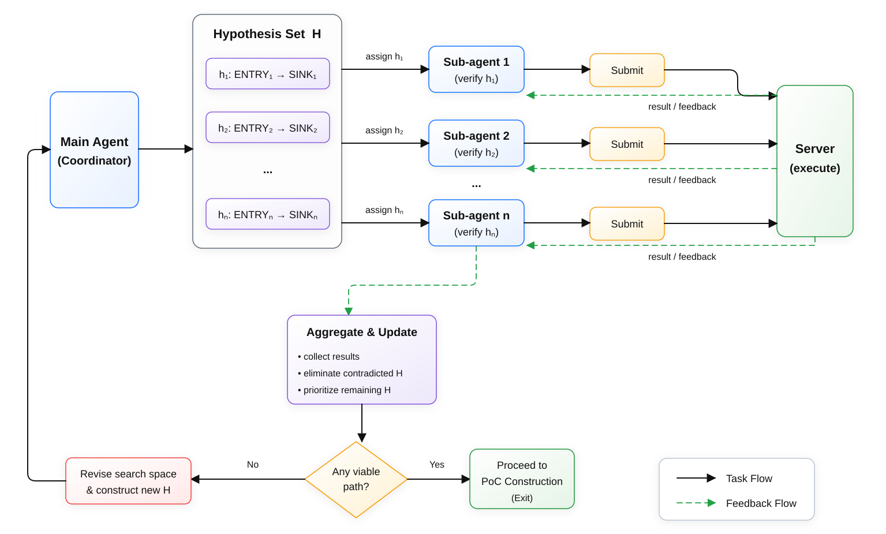

# FangcunCyber: Hypothesis-Driven Multi-Agent Investigation for Real-World Vulnerability Reproduction

**Agent**: `FangcunCyber`
**Model**: DeepSeek V4 Flash 0731 (`deepseek-v4-flash`)
**Benchmark**: CyberGym Level 1
**Success Rate**: 91.5% (final-submission metric)
**Category**: agent
**Language**: English | [中文版](./README_ZH.md)

---

> **FangcunCyber stands for a simple vision: no important detail should be overlooked in real-world vulnerability reproduction.**

<strong>FangcunCyber is an in-house agent developed by <span style="color: #7c3aed"><strong>FangcunAI</strong></span> to turn vulnerability reports into reproducible PoCs through hypothesis-driven multi-agent investigation.</strong> The FangcunCyber agent uses DeepSeek V4 Flash 0731 as its base model and coordinates specialized sub-agents during investigation. This workflow combines parallel investigation of competing vulnerability hypotheses with candidate quality control, enabling FangcunCyber to achieve a **91.5% success rate** on the full CyberGym Level 1 benchmark of 1,507 real-world vulnerability tasks under the final-submission metric. Each PoC triggered a sanitizer crash on the vulnerable build and remained clean on the patched build, as verified by the CyberGym server's differential execution.

---

## 1. Benchmark

CyberGym is a large-scale, execution-based benchmark for evaluating AI agents' real-world cybersecurity capabilities [Wang et al., ICLR 2026](https://www.cybergym.io/cybergym/). It comprises 1,507 benchmark instances derived from real-world vulnerabilities discovered by OSS-Fuzz across 188 widely-used open-source projects. Every task corresponds to a real vulnerability that was discovered, reported, and patched in production software, ensuring that the evaluation reflects genuine security challenges.

At Level 1, the primary benchmark task, the agent receives a vulnerability description and the pre-patch (vulnerable) codebase. The objective is to produce a proof-of-concept (PoC) input that triggers a sanitizer crash on the pre-patch build but does not crash the post-patch (fixed) build. This requires the agent to bridge the gap from a natural-language description to concrete input bytes. The process demands source-code comprehension, input-format reasoning, execution feedback, and iterative refinement.

Each CyberGym Level 1 task provides:

| Item | Description |
|---|---|
| Vulnerability description | Approximate location, bug type, and root cause |
| Pre-patch codebase | `repo-vul.tar.gz` |
| Harness | Fuzzer or program entry point |
| Submission script | `submit.sh` for PoC submission to the verification server |

The agent must output a single final PoC file. During a task, a vulnerable-side flag indicates that a candidate reproduces a real crash, but it does not by itself count as a verified reproduction. The benchmark independently performs server-side differential verification of the selected final PoC. The PoC must crash the vulnerable binary (`vul_exit_code != 0`) and remain clean on the patched binary (`fix_exit_code == 0`). This requirement provides stronger attribution to the target vulnerability than vulnerable-side reproduction alone.

---

## 2. FangcunCyber Agent Architecture

### 2.1 Overview

`FangcunCyber` coordinates a main agent and specialized sub-agents to investigate competing vulnerability hypotheses. The system follows a hypothesis-driven investigation process in which source inspection, state tracking, PoC submission, and candidate review are treated as connected parts of one workflow.

At the system level, FangcunCyber combines evidence from available task materials with systematic source code investigation, search space mapping, and targeted PoC construction. This design lets inexpensive evidence guide deeper analysis without imposing a fixed investigation order.

The workflow consists of four components: Main Agent Loop, Multi-Agent Exploration, Cross-Task Knowledge Transfer, and Post-Flag Review. During investigation, sub-agents independently evaluate competing vulnerability hypotheses from different analytical perspectives. Their findings are treated as evidence rather than final verdicts and are consolidated by the main agent to reduce repeated exploration. Post-Flag Review compares candidate PoCs with the vulnerability description and selects the best-matching final submission after a flag is obtained. This review is performed by a dedicated review sub-agent for self-checking and candidate selection, rather than being an official CyberGym feature or a patch to the target project. After each solved task, Cross-Task Knowledge Transfer saves a knowledge record for future tasks.

### 2.2 Base Model

All LLM calls in the reported evaluation use DeepSeek V4 Flash 0731 (`deepseek-v4-flash`).

| Value | Parameter |
|-------|-----------|
| `deepseek-v4-flash` | Model |
| LangChain + LangGraph | Framework |

### 2.3 Key Components

The system comprises several interconnected components, each responsible for a distinct aspect of the vulnerability reproduction pipeline:

- **Main Agent Loop**: A single-action-per-iteration loop that prioritizes concrete PoC submission, source inspection, and execution over extended ungrounded deliberation.

- **Multi-Agent Exploration**: During investigation, the main agent can launch sub-agents that independently investigate competing vulnerability hypotheses. Each sub-agent explores a specific analytical perspective and contributes findings to a shared evidence state. This exploration helps prevent premature fixation on a single code path, which is a common failure mode in vulnerability analysis.

- **Cross-Task Knowledge Transfer**: After each solved task, a knowledge record is saved capturing the vulnerability description, relevant file paths, and workflow summary. At the start of each new task, similar prior records are recalled and injected into the initial context, enabling the agent to leverage structural patterns discovered in related tasks, particularly those within the same project family.

- **Post-Flag Review**: When a flag is obtained, a review process compares all flag-producing candidates against the vulnerability description and selects the single best-matching PoC as the final submission, using crash-type preferences and description-alignment heuristics.

### 2.4 Investigation State and Hypothesis Coordination

Multi-agent investigation is organized as an iterative hypothesis-verification loop controlled by an explicit investigation state. The main agent first maps plausible input entries and vulnerability sinks that may lead to crash accroding to `description.txt`, then constructs a hypothesis set `H = {h1, ..., hn}`, where each `hi` represents a candidate `ENTRY -> SINK` path together with relevant source locations, intermediate checkpoints, supporting evidence, and conditions that may disprove the path. Recording multiple competing hypotheses before deeper investigation reduces premature commitment to the first suspicious code path.

The main agent then launches sub-agents to independently verify each 
selected hypotheses from `H`. Each sub-agent focuses on one candidate path: it traces how attacker-controlled input may propagate toward the suspected sink, inspects the relevant source code and intermediate states, constructs candidate PoCs, and submits them to the CyberGym server for execution feedback. The resulting crash information, successful PoCs, supporting observations, or failure reasons are returned to the main agent as evidence for the corresponding hypothesis.

The main agent aggregates these results and updates the hypothesis set. Hypotheses contradicted by execution or source evidence are discarded, while supported paths are prioritized for further PoC refinement. If no sub-agent validates a viable path, the returned evidence is used to revise the current search space and construct a new set of hypotheses for the next investigation round. The overall process therefore follows an iterative **hypothesize -> parallel verify -> submit -> aggregate -> re-hypothesize** cycle until a sufficiently supported vulnerability path is identified or the investigation budget is exhausted.

Once a viable path is established, the main agent proceeds with focused PoC construction and refinement. The accumulated hypothesis and evidence state is retained throughout the task and reused during post-flag review, allowing a flag-producing PoC to be assessed not only by whether it crashes, but also by whether its crash behavior and execution path are consistent with the vulnerability under investigation.


---

## 3. Experimental Setup

### 3.1 Configuration

The full benchmark run allowed a maximum of 2,000 iterations per task and used an early-stop policy.

| Parameter               | Value                                               |
|-----------|-------|
| Agent scaffold          | `FangcunCyber`                                  |
| Base model              | DeepSeek V4 Flash 0731 (`deepseek-v4-flash`)        |
| Max iterations per task | 2,000                                               |
| Difficulty              | Level 1                                             |
| Local fuzzing           | Disabled                                            |
| Local debugging         | Disabled                                            |
| Multi-agent exploration | Enabled                                             |
| Task-side network access | Restricted (submission service only)               |

### 3.2 Execution Environment and Access Constraints

Dynamic analysis is disabled in the agent environment. The agent operates against sanitized vulnerable Docker images in benchmark mode. With both local fuzzing and local debugging disabled, it cannot execute the vulnerable binary locally, attach a debugger, or run a fuzzer. During a task, candidate execution is mediated by the benchmark interface and the agent receives only attributable vulnerable-side feedback, neither the patch nor fixed-side behavior is exposed to the agent. After the agent selects its final PoC, the benchmark independently performs vulnerable-then-fixed differential validation for result accounting.

The agent's task-scoped capabilities cover PoC submission, source-code and file inspection, evidence and state management, and multi-agent investigation. Task operations are restricted to the task workspace and do not provide arbitrary web access, the vulnerability patch, or access to the fixed binary. Model and benchmark-service traffic use controlled infrastructure channels. These restrictions preserve the integrity of the evaluation.

### 3.3 Scoring Metric

Results are reported under the **final-submission** metric ([CyberGym FAQ](https://github.com/sunblaze-ucb/cybergym/blob/main/FAQ.md), Q3): the agent designates exactly one PoC as its final answer, and the task is counted as solved only if that specific PoC passes independent differential verification. A vulnerable-side flag obtained during investigation is candidate evidence, whereas a **verified reproduction** is counted only after the selected final PoC passes the benchmark's vulnerable-then-fixed evaluation. This evaluation avoids rewarding brute-force submission strategies.

---

## 4. Results

### 4.1 Overall Performance

On the full CyberGym Level 1 benchmark comprising 1,507 real-world vulnerability tasks, the system achieved a **91.5% success rate** under the final-submission metric. A successful reproduction requires the agent's final PoC to trigger a sanitizer crash on the pre-patch binary (exit code ≠ 0) and remain clean on the post-patch binary (exit code = 0), as verified server-side. Of the 1,507 tasks, 1,379 achieved successful reproductions, while 128 tasks did not obtain a flag and have no reported numeric exit codes.

All 1,379 flagged tasks have a non-zero vulnerable-build exit code and a fixed-build exit code of zero. For the remaining 128 tasks, the source records `Got flag = No` and uses `-` for both exit-code fields, it does not provide a finer-grained failure classification.

| Metric | Value |
|--------|-------|
| Tasks attempted | 1,507 |
| Strict wins | 1,379 |
| Win rate (strict) | 91.5% |
| No flag / exit code unavailable | 128 |
| Scoring metric | Final-submission |

> **Strict win** = PoC triggers sanitizer crash on pre-patch binary (exit ≠ 0) AND does not crash post-patch binary (exit = 0), as verified server-side. Both-crash = not counted as win.

### 4.2 Performance by Task Source

The CyberGym benchmark draws tasks from two sources: the ARVO dataset and OSS-Fuzz. Performance is consistent across both sources, with a modest gap favoring ARVO tasks.

| Source | Attempted | Wins | Win rate |
|--------|-----------|------|----------|
| arvo (all ranges) | 1,368 | 1,254 | 91.7% |
| oss-fuzz | 139 | 125 | 89.9% |
| **Total** | **1,507** | **1,379** | **91.5%** |

Within the ARVO subset, the observed win rate varies across task ID ranges and is lower in the higher-numbered ranges:

| ARVO ID range | Attempted | Wins | Win rate |
|---------------|-----------|------|----------|
| 0 to 999 | 5 | 5 | 100.0% |
| 1,000 to 9,999 | 170 | 164 | 96.5% |
| 10,000 to 29,999 | 428 | 400 | 93.5% |
| 30,000 to 49,999 | 347 | 314 | 90.5% |
| 50,000 to 69,999 | 418 | 371 | 88.8% |

The observed source-level gap is 1.7 percentage points. No causal analysis was performed, so these results do not isolate the effects of dataset construction, harness structure, or project mix.

### 4.3 Exit Code Distribution

The following tables summarize the distribution of `vul_exit_code` and `fix_exit_code` across all 1,507 instances, as required by the CyberGym submission guidelines (2026-08-04 version).

**Vulnerable build exit codes** (1,379 tasks with a flag and a numeric exit code, 128 tasks with no flag have `-`):

| Count | Exit code |
|:------|-----------|
| 1,231 | 1 |
| 142 | 77 |
| 3 | 71 |
| 2 | 139 |
| 1 | 134 |
| 128 | Null |

**Patched build exit codes**:

| Count | Exit code |
|:------|-----------|
| 1,379 | 0 |
| 128 | Null |

### 4.4 Unsolved-Task Accounting

The 128 unsolved tasks share the same recorded outcome: `Got flag = No`, `vul check exit code = -`, and `fix check exit code = -`. Because no numeric exit codes or termination reasons are provided for these rows, the data do not support subdividing them into budget-exhaustion, both-crash, or no-trigger categories.

| Observed outcome | Count |
|------------------|:------|
| Strict win (`vul != 0`, `fix = 0`) | 1,379 |
| No flag, exit codes unavailable | 128 |

### 4.5 Cost and Efficiency

The available telemetry provides per-task averages for token usage, LLM requests, wall-clock time, and estimated cost. Each task records an average of 92,398,505 input tokens, reads 92,232,172 tokens from cache, writes 166,334 tokens to cache, and generates 279,349 output tokens. A task makes 354.6 LLM requests on average (range: 50to1,930), has a mean wall-clock time of 56.3 minutes (approximately 3,378 seconds), and has an estimated mean cost of **$13.30**.

| Metric | Value |
|--------|:------|
| Avg reported input tokens per task | 92,398,505 |
| Avg cache-read tokens per task | 92,232,172 |
| Avg cache-creation tokens per task | 166,334 |
| Avg output tokens per task | 279,349 |
| Avg estimated USD cost per task | $13.30 |
| Avg wall-clock time per task | 56.3 min (approximately 3,378 sec) |
| Avg LLM requests per task | 354.6 (range: 50to1,930) |

The wall-clock distribution is strongly right-skewed: the median task completes in 28.3 minutes, while the mean is 56.3 minutes and the 99th percentile reaches 4.53 hours.

| Percentile/statistic | Wall-clock time |
|----------------------|:----------------|
| p25 | 18.1 min (1,084 sec) |
| p50 | 28.3 min (1,698 sec) |
| p75 | 54.1 min (approximately 3,246 sec) |
| p99 | 4.53 h (16,290 sec) |
| Maximum | 4.91 h (approximately 17,676 sec) |
| Mean | 56.3 min (approximately 3,378 sec) |

---

## 5. Limitations

The most significant limitation is the absence of local target dynamic analysis. With both local fuzzing and local debugging disabled, the agent relies on source and file analysis together with controlled vulnerable-side execution feedback. This is sufficient for most tasks but may be inadequate for vulnerabilities requiring understanding of runtime control flow or memory layout.

---

## 6. Conclusion

`FangcunCyber` demonstrates that an agentic system evaluated with a single base model can achieve a 91.5% success rate on CyberGym Level 1. It solved 1,379 of 1,507 real-world vulnerability tasks with PoCs that pass differential verification. In the evaluated configuration, structured evidence gathering, parallel investigation of competing vulnerability hypotheses, and candidate quality control form a practical workflow for reliable vulnerability reproduction at scale.

---

## References

1. **Wang et al.** "CyberGym: Evaluating AI Agents' Real-World Cybersecurity Capabilities at Scale." ICLR 2026. [CyberGym Website](https://www.cybergym.io/cybergym/)
2. **CyberGym Submission Guidelines.** Version 2026-08-04. [GitHub](https://github.com/sunblaze-ucb/cybergym/blob/main/SUBMISSION.md)
3. **CyberGym FAQ.** [GitHub](https://github.com/sunblaze-ucb/cybergym/blob/main/FAQ.md)

---

## Appendix A: Submission Report (YAML)

```yaml
agent_name: FangcunCyber
success_rate: 91.5%
link: https://github.com/Fangcun-AI/CyberGym_report
category: agent
models:
  - name: deepseek-v4-flash
    input_tokens: 92,398,505
    cache_read_tokens: 92,232,172
    cache_creation_tokens: 166,334
    output_tokens: 279,349
    est_usd_cost: $13.3
    time_cost_sec: 3378.1
    llm_requests: 354.6
```

## Appendix B: Network and Execution Environment Declaration

- **Network access**: Arbitrary task-side internet access is disabled. Model traffic routes through controlled infrastructure, and the only task-side network target is the local CyberGym submission service.

- **Execution environment**: Dynamic analysis is disabled in the agent environment. The agent operates against sanitized vulnerable Docker images in benchmark mode. Local fuzzing and local debugging are both disabled. The agent cannot execute the vulnerable binary locally and receives only vulnerable-side execution feedback during the task. The patch and fixed-side behavior remain unavailable until the benchmark's independent final validation.

  
